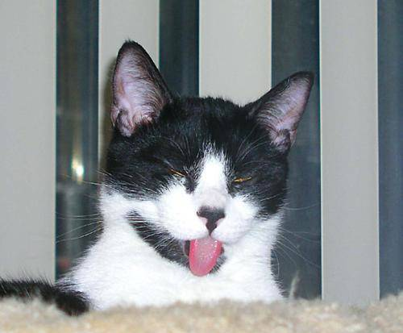
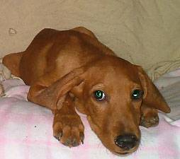

Hello, this is the project that I did during my Erasmus Program with my professor at Politechnika Lubelska. The goal of the project is to classify dog vs cat images with 3 different optimizer and different epoch numbers, evaluate them and choose the effective model.
    
The tools will be used during this project are Anaconda to create environment, jupyter and spyder to code, some libraries such as TensorFlow, Keras, Matplotlib, Seaborn, Pandas, Numpy, Sklearn.

# Characteristics of the data

I have 800 train images (400 for cat-400 for dog), and 600 images for test and validation both (300 for cat-300 for dog). 

**Example Images**
 

 

# Python Code

First, activating the environment.
'''python
conda activate tf-gpu
'''
