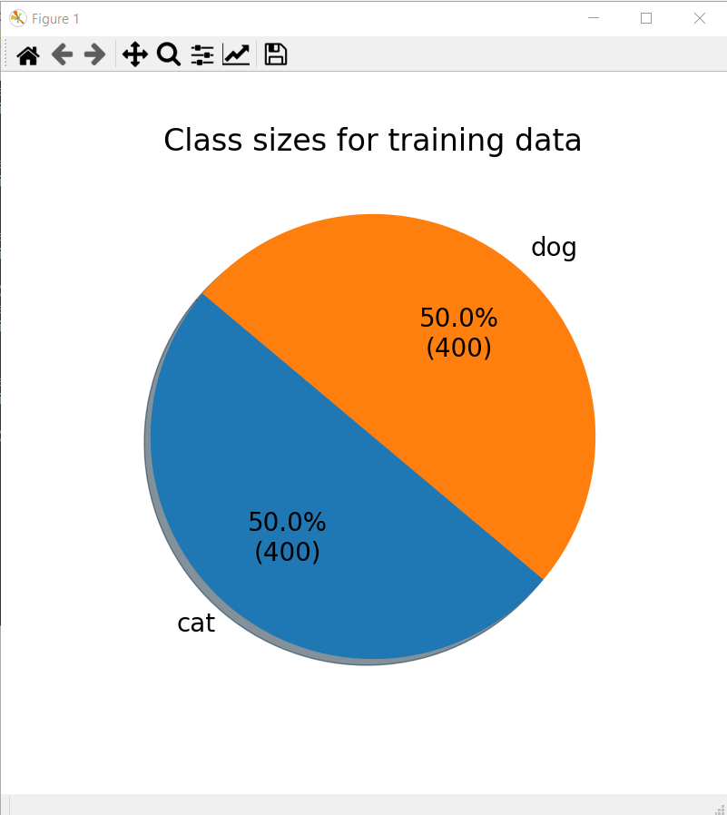
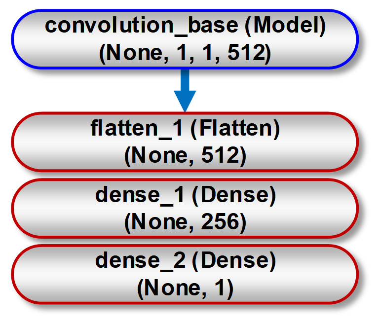
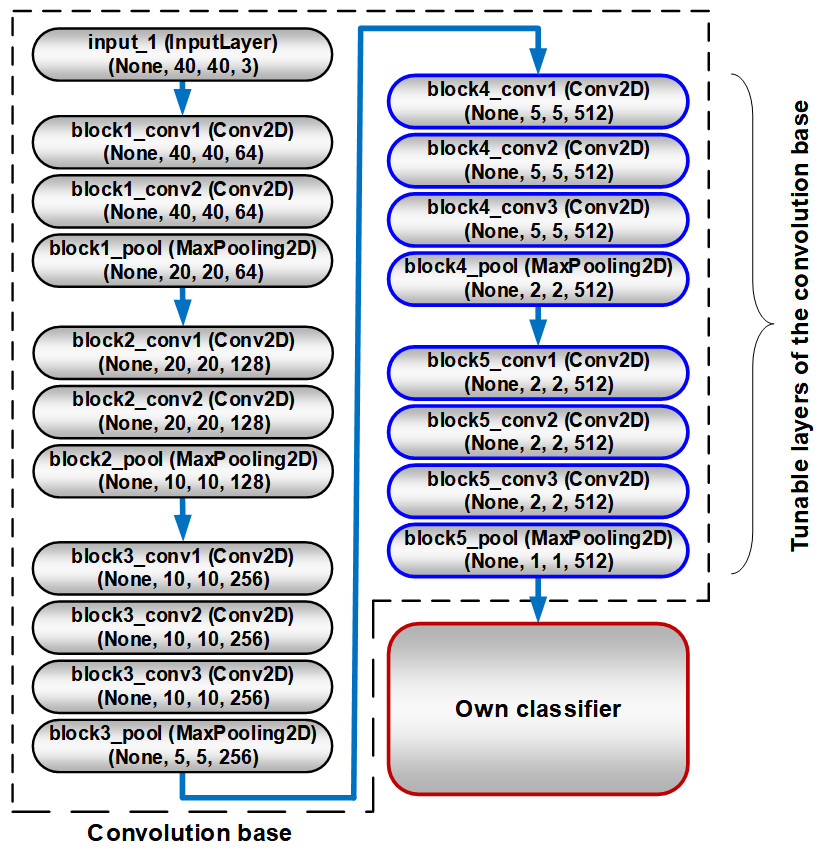

Hello, this is a deep learning project that I did during my Erasmus Program with my professor at Politechnika Lubelska. The goal of the project is to classify dog vs cat images with 3 different optimizer and different epoch numbers, evaluate them and choose the effective model.
    
The tools will be used during this project are Anaconda to create environment, jupyter and spyder to code, some libraries such as TensorFlow, Keras, Matplotlib, Seaborn, Pandas, Numpy, Sklearn.


# Characteristics of the data

I have 800 train images (400 for cat-400 for dog), and 600 images for test and validation both (300 for cat-300 for dog). 

**Example Images**
<br>

<br>


# Python Code

First, activating the environment.

```python
-conda activate tf-gpu
```
Then, I set the parameters. I will build a binary classification model and for the loss function, I will use binary_crossentropy. Batch sizes 8 for train and validation. The model which I use is VGG16. So, input shape is (224, 224, 3). I will build a model with 100 epochs first (50 for training and 50 for tuning) and then I will try to find the most effective epoch number for each optimizer.
```python
CLASS_MODE = 'binary'
LOSS_TYPE ='binary_crossentropy'    
CLASSES_NUMBER = 0
IMAGE_SIZE = (224, 224)
INPUT_SHAPE = (224, 224, 3)
TRAIN_BATCH_SIZE = 8
VAL_BATCH_SIZE = 8

TRAINING_EPOCHS = 50
TUNNING_EPOCHS = 50
```

The first model that I will build is using RMSprop optimization algorithm. The metrics will be accuracy for classification model.
```python
model.compile(loss=LOSS_TYPE,
                  optimizer=optimizers.RMSprop(lr=LR),
                  metrics=['acc'])  
```
So, I run the function.

```python
-python modelBuilding.py
```

Sizes for training and validation can be seen from the figures.
<br>

<br>


# RMSprop Optimization Algorithm
Now, the model has been downloaded from its github page and the model training has been started. These are the last 5 epochs for model training.


After the training completed, frozen top layers has become unfrozen and the model tuning has been started. The reason why we do that:





* This is VGG16 model without top layers. We downloaded it and then we freeze this to build our own classifier.
```python
baseModel = VGG16(weights='imagenet', include_top=False, input_shape=INPUT_SHAPE)            
model = Sequential()    
model.add(baseModel)
model.add(Flatten())
model.add(Dense(256, activation='relu'))
model.add(Dense(1, activation='sigmoid'))
```





* This is our own classifier. We've add input layers and with flatten, it has become 512 layers, 256 hidden layers and its activation function is relu and 1 output layer with sigmoid activation function. With this model, we did the training. After the training completed, we unfrozen the top layers which and tune the model with them to get more efficient model.

```python
def freezeModel(baseModel):    
    for layer in baseModel.layers:
        layer.trainable = False 
        
freezeModel(baseModel)
```
Now, it's time to tune the model. These are the last 5 epochs for model tuning.


Let's check accuracy and loss figures and see if we can use less epochs to get better result or not.


First 50 epochs for training. We need to check after the green line at the middle for if we get more efficient model or not. As it can be seen, at the 70. epoch, the validation loss has its lowest value. So that means, there is an overfitting problem after this epoch number. Let's rerun the model with 70 epochs (50 for training-20 for tuning) and check if we get more efficient model or not.


And the loss figure:


It's time to compare these 2 results. Let's see if we could improve our model or not.
```python
-python modelTesting.py
```


When we check the confusion matrix, we have 16 false positives for cat and 10 for dog. So, it's just 26 mistakes of 600 images.


Total test accuracy is almost 0.96 which is very good and the loss is 0.24. Let's see the model with 70 epochs.


It seems like, mistakes have been increased. 


**But when we check total test accuracy and test loss, our accuracy has decreased but not significantly much. But when we check difference of losses, our loss has decreased from 0.24 to 0.15 which means, our loss is significantly improved with decrasing by %37.5. So, the model with 70 epochs is more efficient to use.**


# RMSprop Optimization Algorithm
Now, it's time to do the same things with ADAM optimization algorithm. First, I will try with 100 epochs again (50 for training-50 for tuning)

```python
model.compile(loss=LOSS_TYPE,
                  optimizer=optimizers.Adam(lr=LR),
                  metrics=['acc'])  
```

```python
-python modelBuilding.py
```
Here is the last 5 epochs of training.


Now, the top layers has been unfrozen annd these are the last 5 epochs for tuning.


It's time to check accuracy and loss figures.


Validation loss gets its lowest value at 93. epoch. So let's rerun the model with 93 epochs (50 training-43 tuning) and see if there is any improvement or not.


And the loss figure:


And it's time to compare
```python
-python modelTesting.py
```
First the confusion matrix. When we observe that, there are 26 mistakes just as the model with 100 epochs and RMSprop optimizer. 


And the total test accuracy and test loss. The same accuracy with the model with 100 epochs RMSprop optimizer, but the loss is more better.


And these are the result for the model with 93 epochs.


